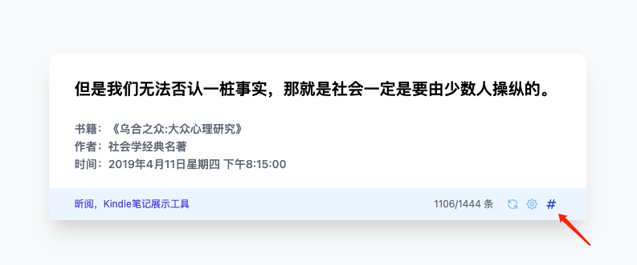
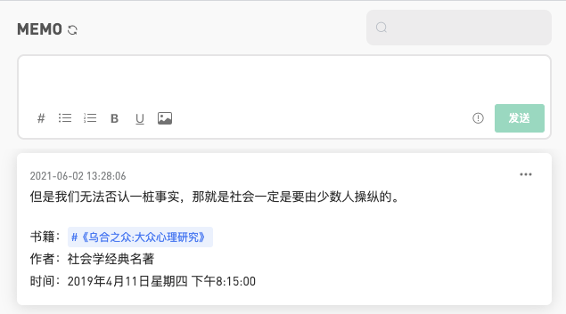

<h1 align="center">昕阅1.0 - xinReader</h1>

Kindle笔记展示工具，让你过去记录的内容不被遗忘

将Kindel的My Clippings.txt笔记展示在浏览器中，还可推送至flomo。

欢迎使用<a target="_blank" href="https://github.com/nihaojob/xinReader/archive/refs/heads/main.zip">下载</a>体验，或在<a target="_blank" href="https://chrome.google.com/webstore/detail/%E6%98%95%E9%98%85/hafbbdlpbhfbbonpnffghcajgkmgmdpi?utm_source=chrome-ntp-icon">chrome商店安装</a>，遇到问题可与我联系哦。

&nbsp;

与你分享我的<a target="_blank" href="./doc/My Clippings.txt">My Clippings.txt</a>文件。

## Preview

## Install

1. 将文件[下载](https://github.com/nihaojob/xinReader/archive/refs/heads/main.zip)文件到本地。
2. chrome设置 => 扩展程序，打开开发者模式，加载已解压的扩展程序，选中`src`目录。
3. chrome设置 => 启动时选项，选择打开新标签页。
## Use
打开新页面，导入`My Clippings.txt`文件。

设置完成后，每次打开新页面就会展示一条笔记。

## Share to flomo
还不了解flomo？进入[邀请链接](https://flomoapp.com/register2/?Njc3Nzk)了解吧。

1. 设置页面点击`flomo`按钮。
2. 填入[flomo API](https://help.flomoapp.com/advance/api)地址。
3. 点击`#`图标，保存到你的flomo中。

## Author
秦少卫

nihaojob@163.com

https://juejin.cn/user/3843548383549214/posts

